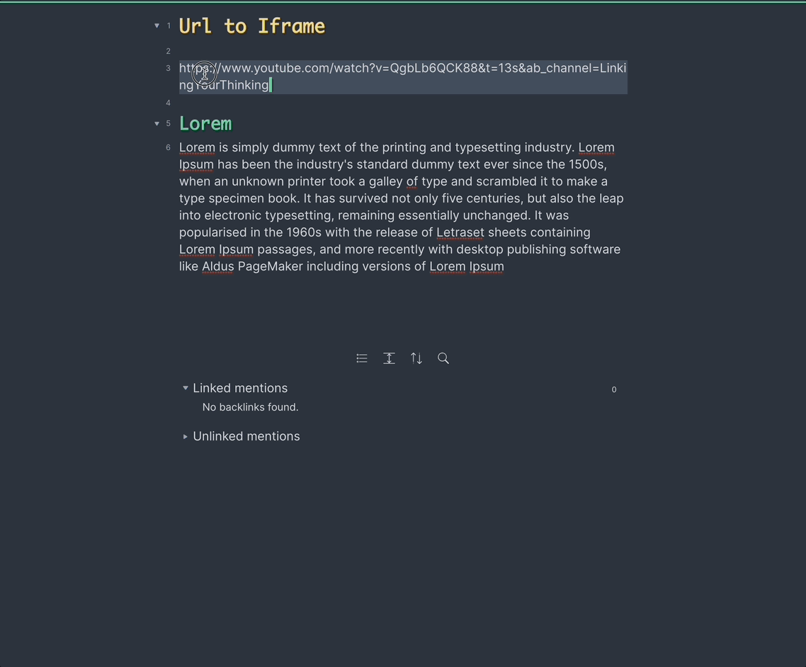
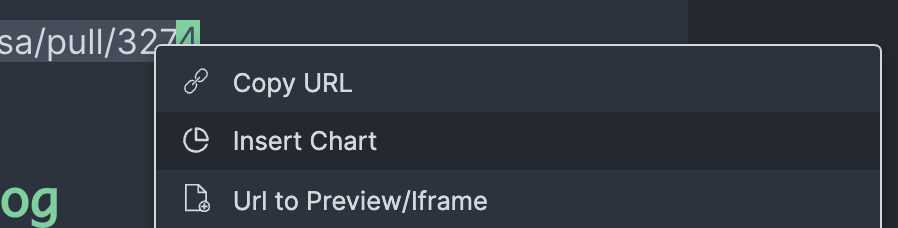

# Obsidian Plugin: Convert a URL (e.g. YouTube) into an iframe (preview)
**Transform any URL into a preview.**

1. Select an url 
2. right click on it (or use the command `Convert to Url Preview`)
3. Click on `Url to Preview/Iframe`.

The default hotkey is `cmd + alt + i`.

# Installation
Support for 3rd party plugins is enabled in settings (Obsidian > Settings > Third Party plugin > Safe mode - OFF)
To install this plugin, download zip archive from GitHub releases page. Extract the archive into <vault>/.obsidian/plugins.

# Change log
## 0.5.0
- Always allow full screen for the iframe. In the future it will be an option

## 0.4.0
- Instead of doing a custom mapping to embed for YouTube, we now rely on the OEmbed standard. Thanks to https://www.npmjs.com/package/oembed-parser 
    - This allows to preserve the timestamp on Youtube and to get default size for many websites.
- Add contextual menu (right click on a link) 

## 0.3.0
- Simplify the output when using a recent Obsidian download, by leveraging `aspect-ratio` css.

## 0.2.0
- Update: the keybinding from `Mode + Shift + I` to `Alt + I` ([Issue 4](https://github.com/FHachez/obsidian-convert-url-to-iframe/issues/4)) 
- Only output the app name in the console ([Issue 3](https://github.com/FHachez/obsidian-convert-url-to-iframe/issues/3))
- Add a aspect Ratio (defaults to 16:9 aspect ratio). (Kankaristo).
- Make sure the iframe can work without the CSS class. (Kankaristo)
- Fix the bad resizing when using Sliding Panes Plugin ([Issue 1](https://github.com/FHachez/obsidian-convert-url-to-iframe/issues/1)) (Kankaristo)
- Better user messages and README.md (Kankaristo)
- Preserve Youtube's timestamp [Issue 14](https://github.com/FHachez/obsidian-convert-url-to-iframe/issues/14)
- Allow full screen iframes [Issue 8](https://github.com/FHachez/obsidian-convert-url-to-iframe/issues/8)

## 0.1.0
First release

# Thank you
- [Sami Kankaristo](https://github.com/kankaristo)